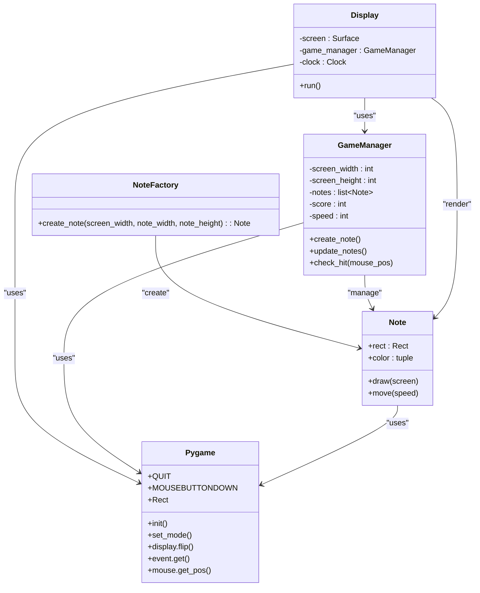

# UML

```mermaid
classDiagram
    direction TB

    class Note {
        +rect : Rect
        +color : tuple
        +draw(screen)
        +move(speed)
    }

    class NoteFactory {
        +create_note(screen_width, note_width, note_height) : Note
    }

    class GameManager {
        -screen_width : int
        -screen_height : int
        -notes : list~Note~
        -score : int
        -speed : int
        +create_note()
        +update_notes()
        +check_hit(mouse_pos)
    }

    class Display {
        -screen : Surface
        -game_manager : GameManager
        -clock : Clock
        +run()
    }

    NoteFactory --> Note : "create"
    GameManager --> Note : "manage"
    Display --> GameManager : "uses"
    Display --> Note : "render"

    class Pygame {
        +init()
        +set_mode()
        +display.flip()
        +event.get()
        +mouse.get_pos()
        +QUIT
        +MOUSEBUTTONDOWN
        +Rect
    }

    Display --> Pygame : "uses"
    GameManager --> Pygame : "uses"
    Note --> Pygame : "uses"
```
